# EduQuest Backend Architecture

## Architecture Decisions

### Routers are HTTP-boundary-only — no business logic lives there

Route handlers in `routers` are responsible for parsing requests, enforcing auth via `Depends()`, and returning responses. All business logic belongs in the service layer. A router handler should do nothing more than call a service method and return its result (plus any private `_helper()` functions scoped to that file for multi-step request wiring, capped at 20 lines each).

### All S3 access goes through `integrations/s3_service.py`

AWS credentials, bucket config, and error handling live in one place. Services must never
instantiate `boto3.client` directly — import helpers from `integrations/s3_service.py` instead.

### Frontend role and ownership checks are UX only — the backend is the enforcement boundary

The frontend may hide buttons, redirect routes, or skip rendering components based on role or ownership. These checks exist to avoid confusing users with options that would fail, not to enforce access control. Every protected action must be independently enforced at the API layer via `require_roles` or an explicit ownership check. Removing a frontend gate should never expose a security gap.

### Auth & Role-Based Access Control

Role enforcement lives exclusively at the **router layer** via FastAPI `Depends()`. Service methods never raise errors for role checks — they assume the caller is already authorized. Service-layer `PermissionError` is reserved for **ownership checks** only (e.g. a teacher editing another teacher's period).

Three roles: `Role.STUDENT`, `Role.TEACHER`, `Role.PARENT` — defined as a `str, Enum` in `api/deps.py` alongside `AuthPayload` and `get_auth()`.

Canonical dependencies (all in `api/deps.py`):

- `get_auth()` — validates JWT, returns `AuthPayload`; use when any authenticated user is allowed.
- `require_roles(Role.X, ...)` — restricts to one or more roles; declare in the route's `Depends()`.
- `require_student_viewer("param_name")` — use when a parent or teacher may optionally pass a student `user_id` to view that student's data.

Supabase RLS is the secondary enforcement layer. Do not duplicate RLS logic in Python.

Audit: `pytest tests/unit/routes/test_rbac_audit.py` verifies every route either has an auth dependency or is listed in `EXPLICITLY_PUBLIC_ROUTES`.

### The frontend never calls Supabase for data reads or writes — all domain data goes through FastAPI

The frontend uses the Supabase client SDK for auth only (sign-up, sign-in, session management).
All domain data reads and writes must go through the FastAPI backend. This keeps business logic
and RLS policy in one place and prevents clients from bypassing server-side validation.

---

## Layers at a Glance

### Architecture Overview

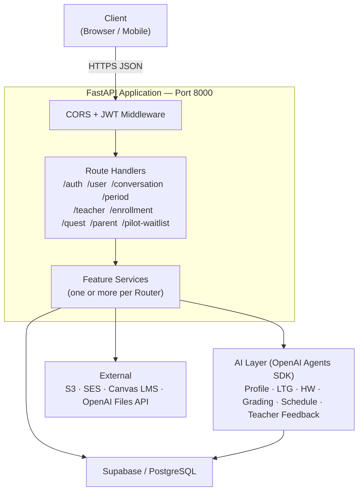

### Service → Dependency Map

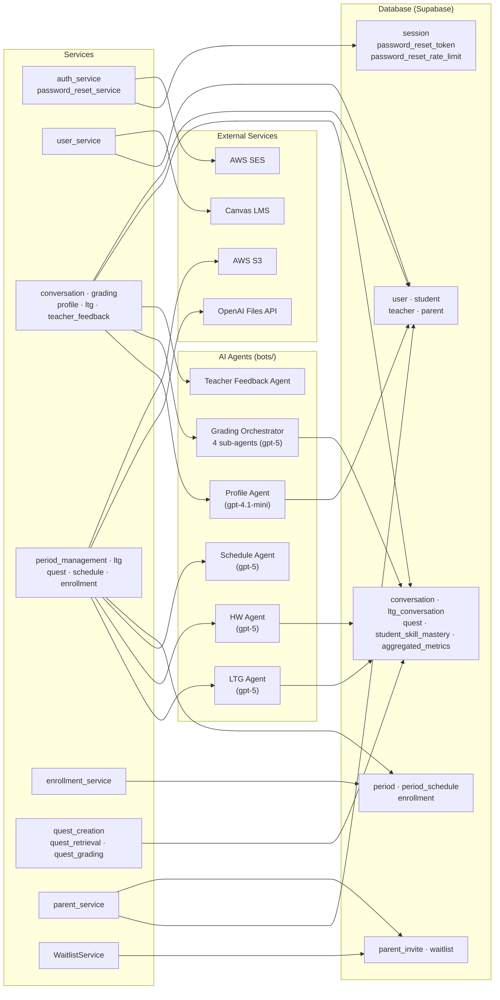

---

## Auth Flows

### Sign Up

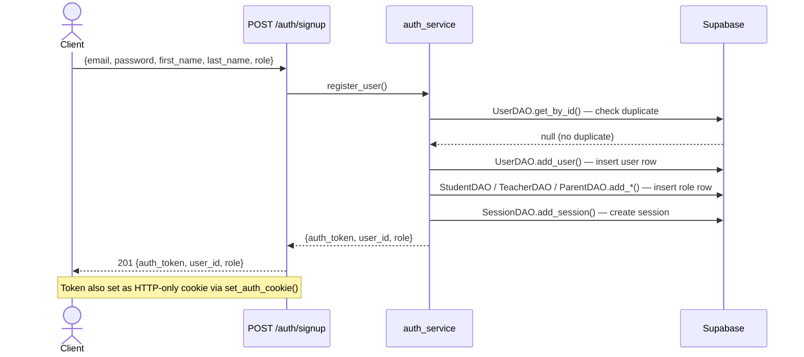

### Login

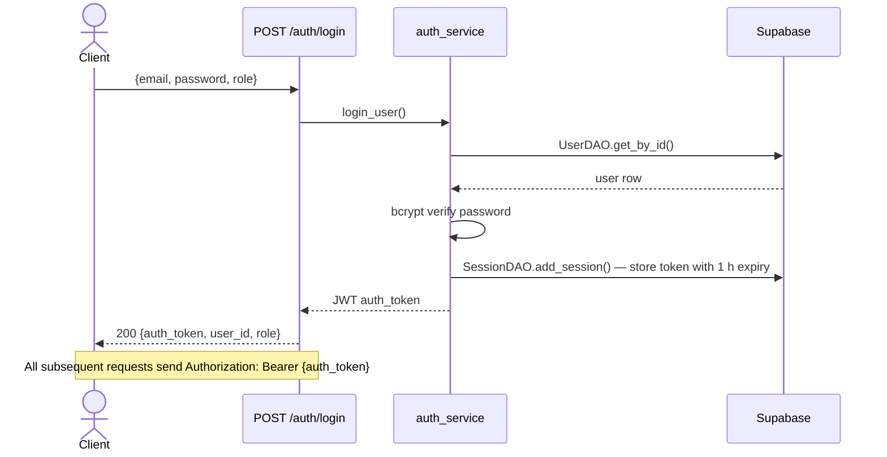

### Password Reset

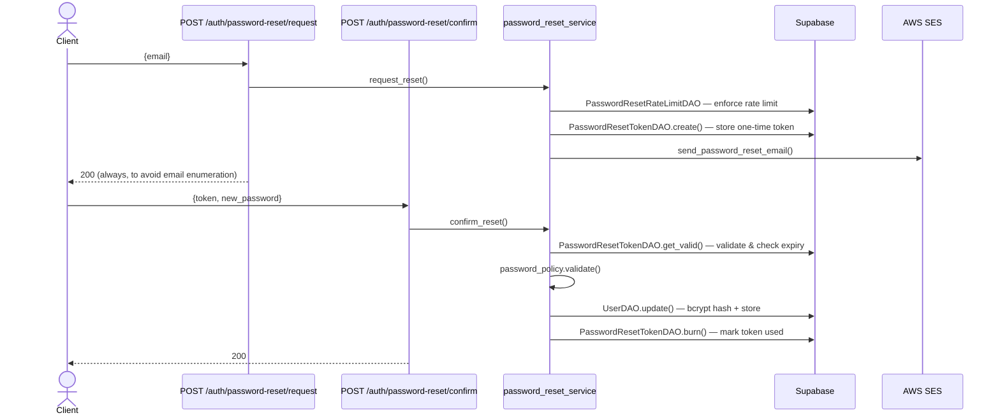

---

## User / Profile Flows

### Get Profile

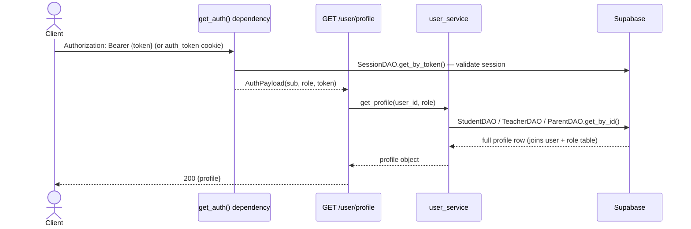

### Connect / Disconnect Canvas

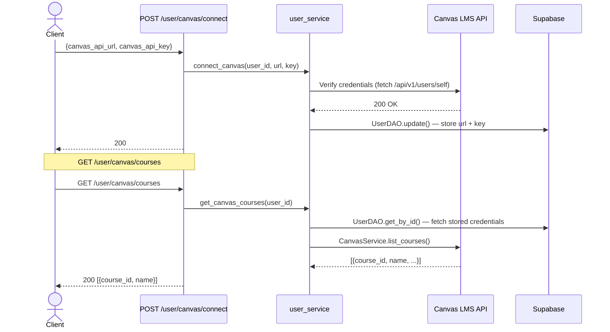

---

## Conversation Flows

All conversation routes require a valid JWT. Conversation state is tracked in the `conversation` table using OpenAI's `last_response_id` from the Responses API — the previous response ID is passed to `Runner.run()` to continue a thread without re-sending history.

### Profile Gathering (New Student Onboarding)

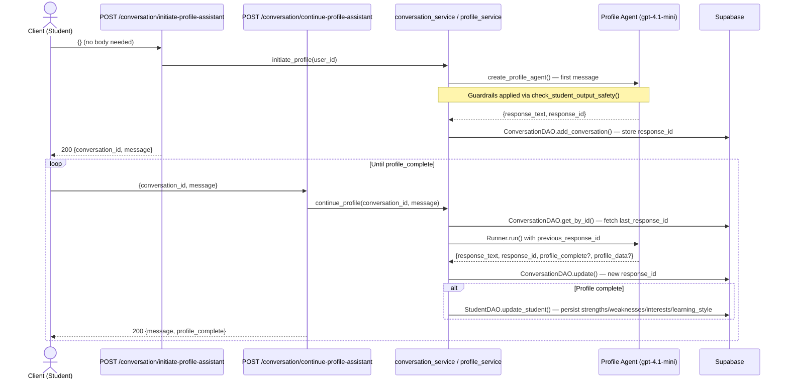

### Grading / Update Assistant

This flow handles student work submissions. The update assistant grades the work via a multi-agent orchestrator then may continue as a follow-up conversation.

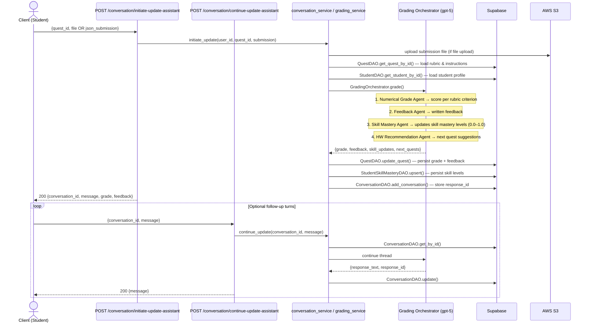

---

## Period Flows

### Create a Period

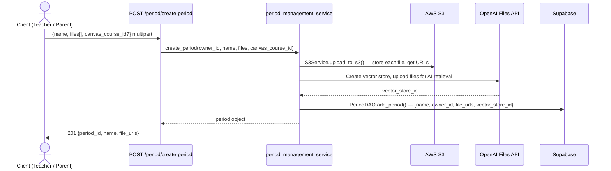

### Add Files to Existing Period

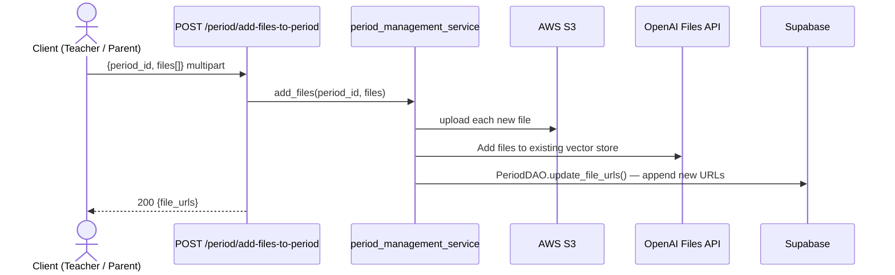

### Get a File (Presigned URL)

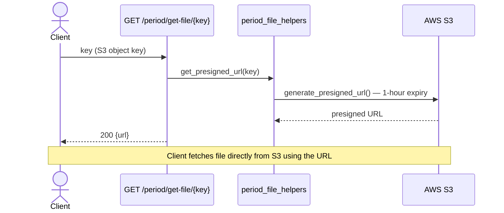

### Generate Quests for a Period

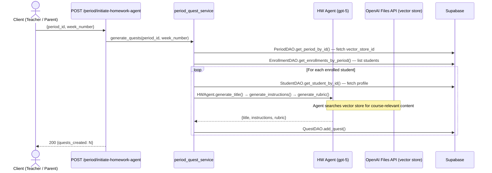

### AI-Generated Period Schedule

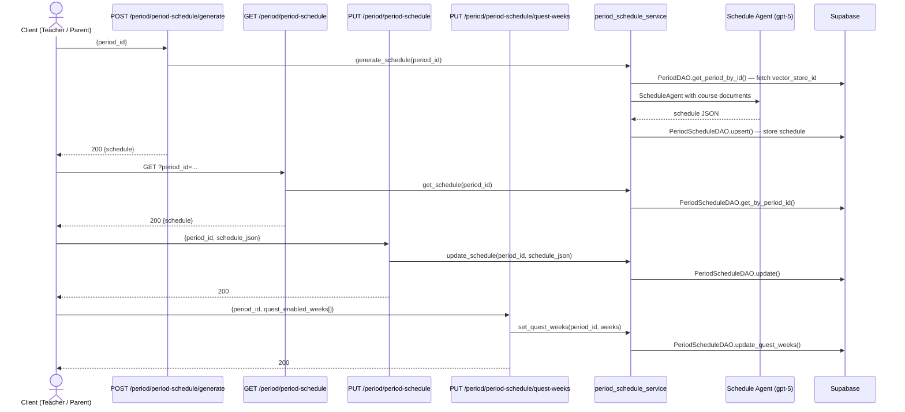

---

## LTG (Long-Term Goal) Flow

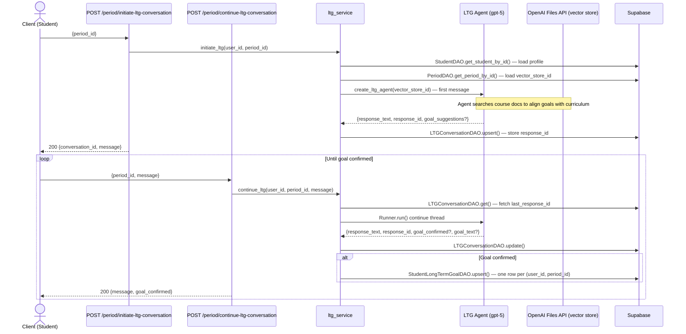

---

## Enrollment Flows

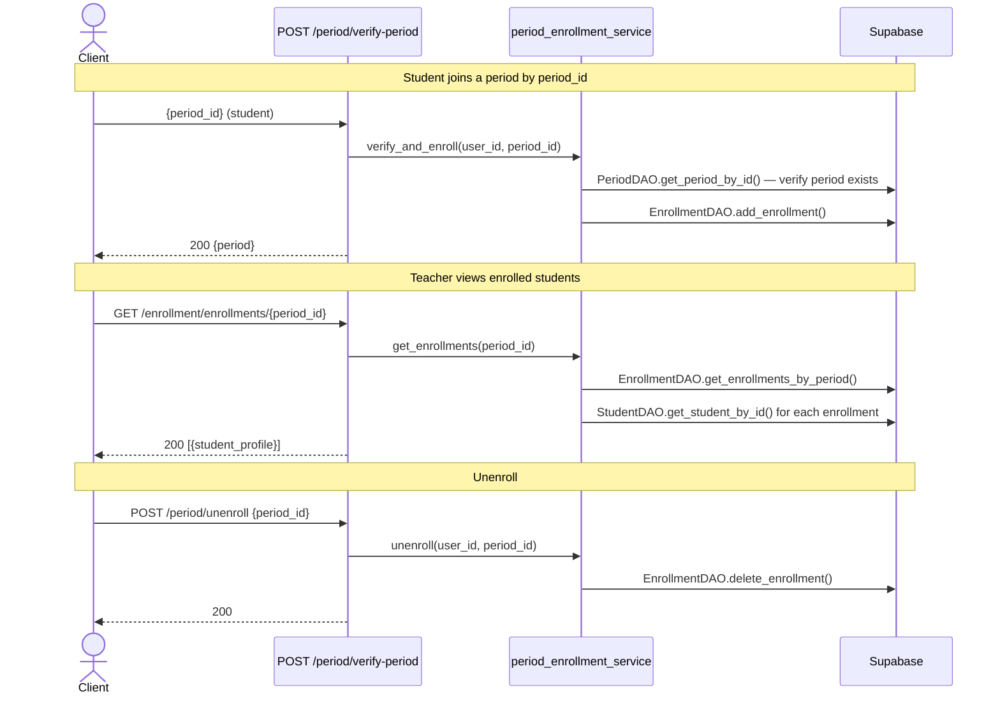

---

## Quest Flows

### Retrieve Quests

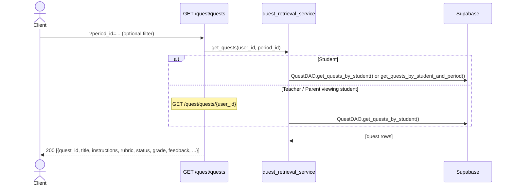

### Update Quest Status

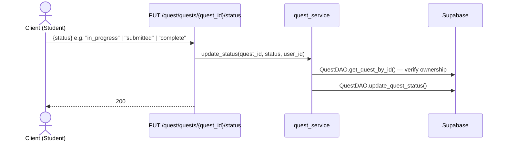

### Grade a Quest (Teacher Override)

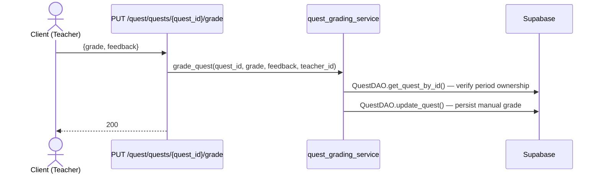

---

## Parent Flows

### Accept Parent Invite (Student Side)

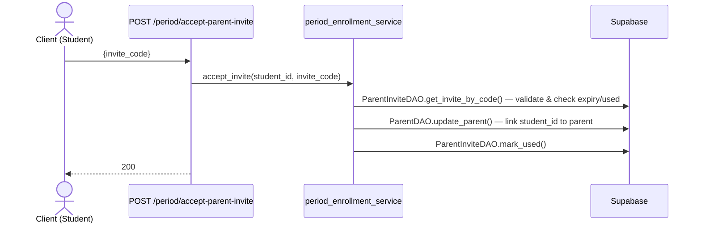

### Generate Invite Code (Parent Side)

```mermaid
sequenceDiagram
    actor P as Client (Parent)
    participant R as POST /parent/generate-invite
    participant S as parent_service
    participant DB as Supabase

    P->>R: {}
    R->>S: generate_invite(parent_id)
    S->>S: uuid / random code, set expiry = now + INVITE_EXPIRY_HOURS (24 h)
    S->>DB: ParentInviteDAO.insert()
    R-->>P: 200  {invite_code, expires_at}
```

---

## Pilot Waitlist Flow

```mermaid
sequenceDiagram
    actor T as Client (Teacher)
    participant R1 as POST /pilot-waitlist/join
    participant R2 as GET  /pilot-waitlist/status
    participant R3 as POST /pilot-waitlist/approve/{user_id}
    participant S as WaitlistService
    participant DB as Supabase

    T->>R1: {referral_code?}
    R1->>S: join(user_id, referral_code)
    S->>DB: WaitlistDAO.insert()  — record position
    R1-->>T: 200  {position}

    T->>R2: GET /pilot-waitlist/status
    R2->>S: get_status(user_id)
    S->>DB: WaitlistDAO.get_by_user_id()
    R2-->>T: 200  {position, approved}

    Note over R3: Admin only
    T->>R3: POST /pilot-waitlist/approve/{user_id}
    R3->>S: approve(user_id)
    S->>DB: TeacherDAO.update_teacher()  — set pilot_approved = true
    S->>DB: WaitlistDAO.update()  — mark approved
    R3-->>T: 200
```

---

## AI Agent Details

All agents live in `bots/` and use the OpenAI Agents SDK (`from agents import Agent, Runner`). Structured outputs use Pydantic schemas in `bots/schemas/`.

| Agent                  | File                                    | Model        | Purpose                                                                                                    |
| ---------------------- | --------------------------------------- | ------------ | ---------------------------------------------------------------------------------------------------------- |
| Profile Agent          | `profile_agent.py`                      | gpt-4.1-mini | Gathers student strengths, weaknesses, interests, learning style via multi-turn chat                       |
| LTG Agent              | `ltg_agent.py`                          | gpt-5        | Suggests 3 long-term goals aligned with course content (uses vector store file search)                     |
| HW Agent               | `agent.py::HWAgent`                     | gpt-5        | Generates personalised quest title, instructions, and rubric per student (async)                           |
| Grading Orchestrator   | `grading_agent.py::GradingOrchestrator` | gpt-5        | 4 sequential sub-agents: numerical grade, written feedback, skill mastery scores, homework recommendations |
| Schedule Agent         | `schedule_agent.py::ScheduleAgent`      | gpt-5        | Generates a weekly schedule from course documents                                                          |
| Teacher Feedback Agent | `teacher_feedback_agent.py`             | gpt-5        | Turns teacher notes into structured feedback for students                                                  |

Content safety is applied via `bots/guardrails.py::check_student_output_safety()` before returning agent responses to the client.

**All agent instantiation goes through `bots/provider.py::get_bot_provider()`** — services never import agent classes directly. This is what makes `MOCK_AI=true` (env) and `set_bot_provider(MockBotProvider())` (tests) work: swapping the provider swaps every agent at once without touching service code.

---

## Data Tables Reference

See [data_access/DATA_TABLES.md](data_access/DATA_TABLES.md).
