# EduQuest Backend Architecture

> Architecture and testing decisions live in [ARCH_DECISIONS.md](ARCH_DECISIONS.md).

## Table of Contents

- [1. Layers at a Glance](#1-layers-at-a-glance)
- [2. Auth](#2-auth)
  - [Sign Up](#sign-up)
  - [Login](#login)
  - [Password Reset](#password-reset)
- [3. User / Profile](#3-user--profile)
- [4. Conversation](#4-conversation)
  - [Profile Assistant](#profile-assistant)
  - [Update Assistant — Student Path](#update-assistant--student-path)
  - [Update Assistant — Instructor Path](#update-assistant--instructor-path)
- [5. Period Management](#5-period-management)
  - [Multipart Upload](#multipart-upload)
  - [Create Period](#create-period)
  - [Finalize Setup Draft](#finalize-setup-draft)
  - [Add Files to Period](#add-files-to-period)
  - [Background File Processing](#background-file-processing)
  - [Summer Quest Trigger](#summer-quest-trigger)
- [6. LTG (Long-Term Goal)](#6-ltg-long-term-goal)
  - [Initiate and Continue LTG](#initiate-and-continue-ltg)
  - [Homework Agent](#homework-agent)
- [7. Curriculum](#7-curriculum)
  - [Generate Curriculum](#generate-curriculum)
  - [Get and Edit Curriculum](#get-and-edit-curriculum)
  - [Approve Curriculum](#approve-curriculum)
- [8. PPTX / Slides](#8-pptx--slides)
  - [PPTX Batch Pipeline](#pptx-batch-pipeline)
  - [Slides Status Check](#slides-status-check)
- [9. Lessons](#9-lessons)
- [10. Enrollment](#10-enrollment)
  - [Verify and Enroll](#verify-and-enroll)
  - [Unenroll Cascade](#unenroll-cascade)
- [11. Quest](#11-quest)
  - [Retrieve Quests](#retrieve-quests)
  - [Teacher Grade Override](#teacher-grade-override)
- [12. Billing](#12-billing)
  - [Checkout Session](#checkout-session)
  - [Stripe Webhook](#stripe-webhook)
- [13. Marketplace](#13-marketplace)
- [14. Parent](#14-parent)
  - [Generate Invite](#generate-invite)
  - [Enroll Student (Parent-Initiated)](#enroll-student-parent-initiated)
- [15. Waitlist](#15-waitlist)
- [16. Feedback](#16-feedback)
- [17. Background Tasks Reference](#17-background-tasks-reference)
- [18. AI Agent Reference](#18-ai-agent-reference)

---

## 1. Layers at a Glance

### Architecture Overview

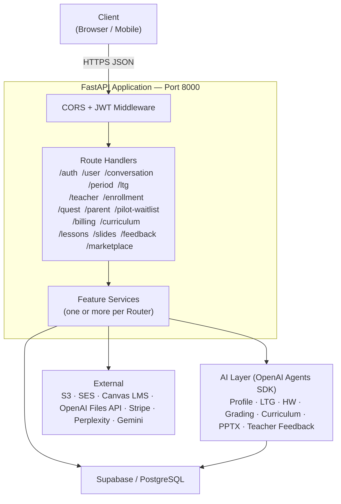

### Service → Dependency Map

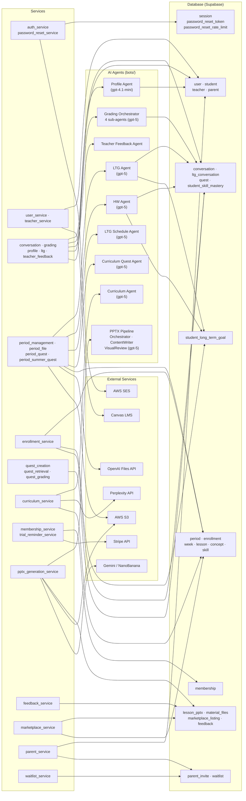

---

## 2. Auth

### Sign Up

```mermaid
sequenceDiagram
    actor C as Client
    participant R as POST /auth/signup
    participant S as auth_service
    participant MS as MembershipService
    participant PS as ParentService
    participant DB as Supabase

    C->>R: {email, password, first_name, last_name, role, grade?, trial_confirmed?, invite_code?}
    R->>R: Validate role; require grade if student; require trial_confirmed if teacher/parent
    R->>S: get_user_by_email(email)
    DB-->>R: null (no duplicate — 409 if found)
    R->>S: register_user(username, password, role, ...)
    S->>S: validate_password(password)
    S->>DB: UserDAO.add_user()
    S->>DB: StudentDAO / TeacherDAO / ParentDAO.add_*()
    S-->>R: {success: true}
    alt role is teacher or parent
        R->>MS: start_trial_if_eligible(user_id, role)
        Note over R,MS: try/except — trial failure must not block signup
        MS->>DB: MembershipDAO.insert() — trialing, 14-day expiry
        R->>R: trial_started = true
    end
    alt role is student and invite_code provided
        R->>PS: accept_invite(user_id, invite_code)
        Note over R,PS: try/except — invite failure must not block signup
        PS->>DB: ParentInviteDAO.validate() and ParentDAO.update_linked_student_ids()
        R->>R: parent_linked = true
    end
    R-->>C: 201 {message, trial_started?, parent_linked?, invite_warning?}
```

### Login

```mermaid
sequenceDiagram
    actor C as Client
    participant R as POST /auth/login
    participant S as auth_service
    participant MS as MembershipService
    participant DB as Supabase

    C->>R: {username, password, role}
    R->>S: authenticate_user(username, password, role)
    S->>DB: UserDAO.get_by_id(username)
    S->>S: verify password (bcrypt; migrates legacy pbkdf2 hash on match)
    S-->>R: authenticated = true
    R->>R: _mint_token(username, role) — HS256 JWT, 1-hour expiry
    R->>S: add_session(session)
    S->>DB: SessionDAO.add_session()
    alt role is student
        R->>S: get_student_by_id(username)
        S->>DB: StudentDAO.get_student_by_id()
        R->>R: needs_profile = true if any of strength/weakness/interest/learning_style is null
    end
    alt role is teacher or parent
        R->>MS: start_trial_if_eligible(username, role)
        Note over R,MS: try/except — backfill for accounts created before trial launch
        MS->>DB: MembershipDAO.upsert() if no row exists
    end
    R->>R: set_auth_cookie(response, token)
    R-->>C: 200 {token, needs_profile?}
    Note over C,R: Subsequent requests: Authorization: Bearer {token}
```

### Password Reset

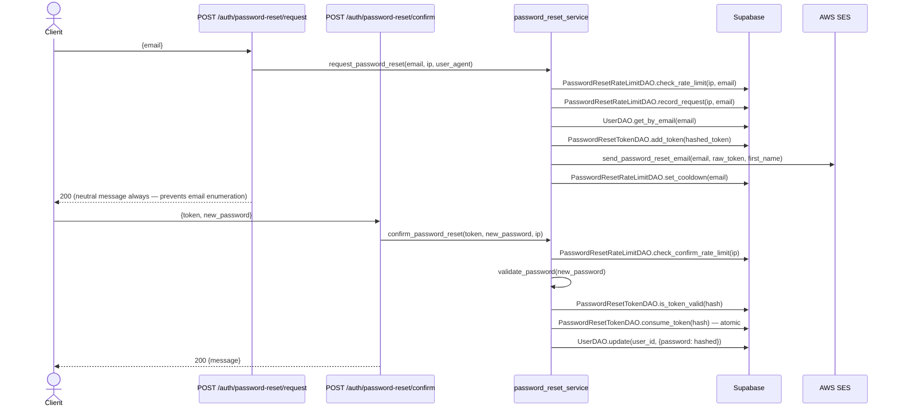

---

## 3. User / Profile

### Get Profile

Response shape varies by role. Teachers and parents receive an inline `membership` snapshot.

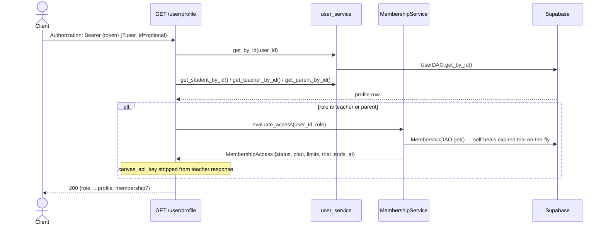

### Tutorial Status

Two simple pass-through routes — no diagrams:

- `GET /user/tutorial-status` → `StudentDAO.get_tutorial_status(user_id)` → `{completed_tutorial: bool}`
- `POST /user/update-tutorial` → `StudentDAO.update_tutorial_status(user_id, completed_tutorial)`

---

## 4. Conversation

### Profile Assistant

State is tracked per conversation via OpenAI's `last_response_id` (Responses API). Profile completion is detected by checking whether all four fields (`strength`, `weakness`, `interest`, `learning_style`) are present in the agent's structured response.

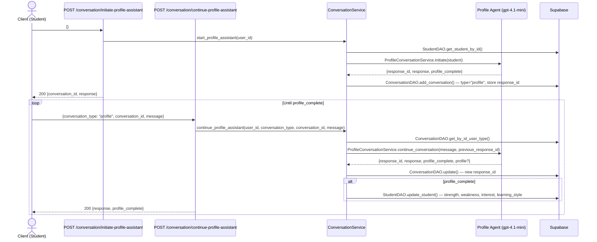

### Update Assistant — Student Path

The student submits work as a multipart form. The grading pipeline runs synchronously inside `loop.run_in_executor()` to avoid asyncio conflicts with the outer FastAPI event loop.

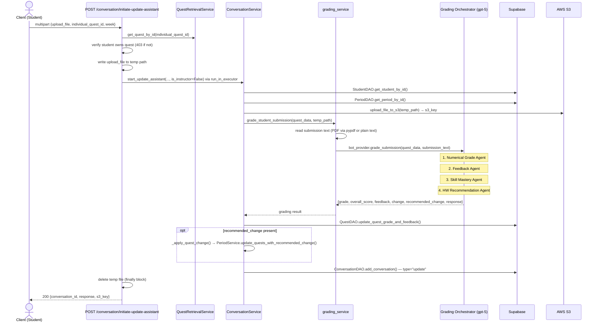

### Update Assistant — Instructor Path

Teachers submit JSON with `is_instructor: true`. No file upload; the teacher feedback agent reviews a summary of all the student's quests.

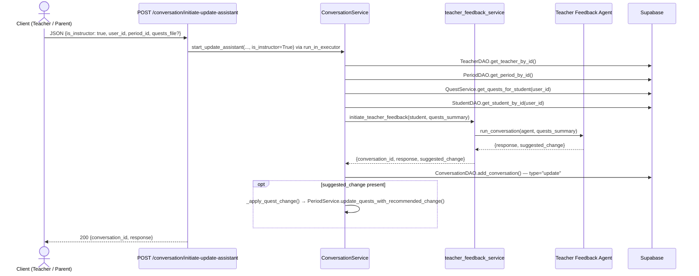

`POST /conversation/continue-update-assistant` continues either conversation type using the same teacher feedback agent thread. Body: `{conversation_id, message}`.

---

## 5. Period Management

### Multipart Upload

Used for large files before calling `create-period`. The client uploads parts directly to S3; the server only brokers presigned URLs.

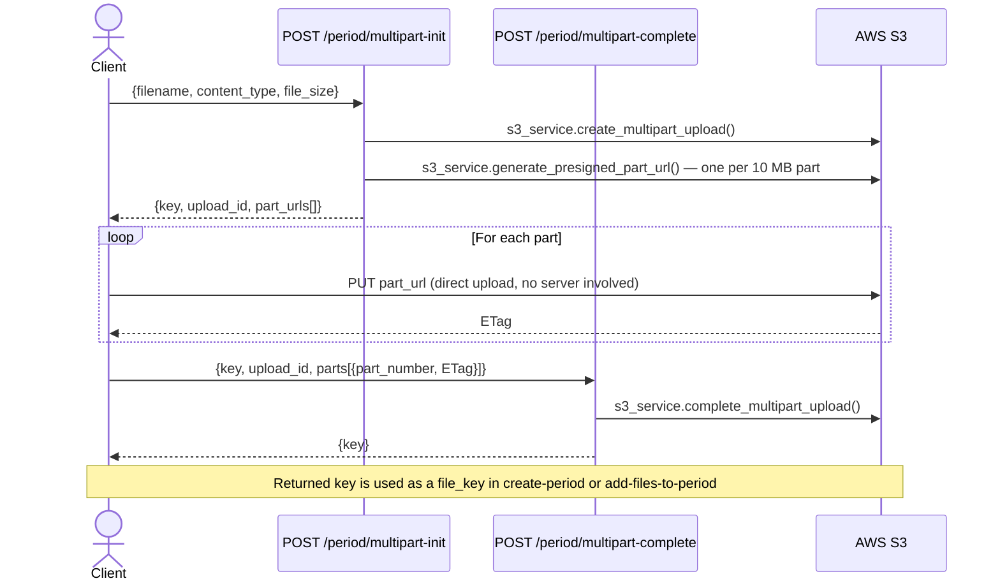

### Create Period

Two paths: `status=pending` starts background file processing immediately; `status=setup_draft` defers it until finalized via `PATCH /period/{id}/setup`.

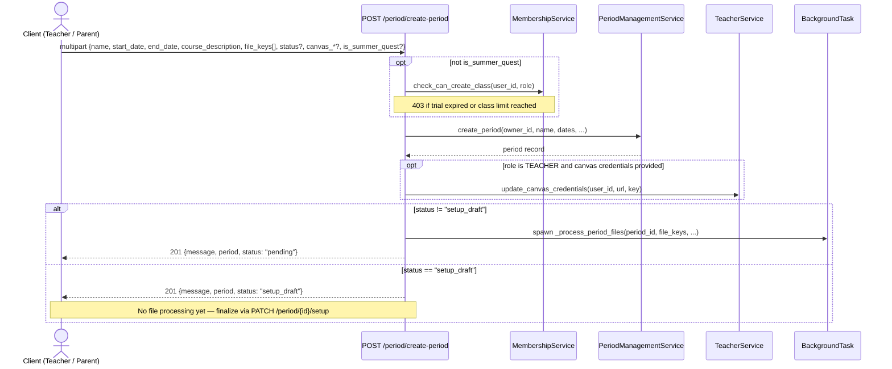

### Finalize Setup Draft

`PATCH /period/{period_id}/setup` updates a draft period. When `status` is changed to `"pending"`, background file processing begins.

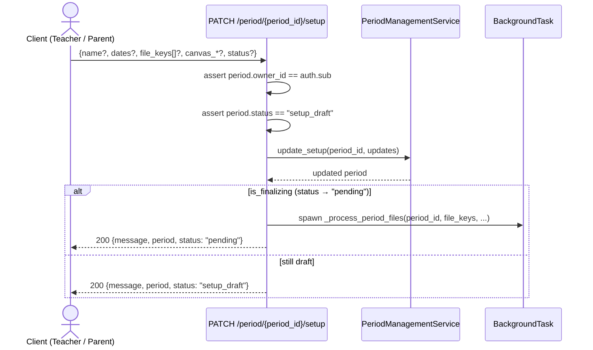

### Add Files to Period

Appends S3 keys to an existing period's file list. Does not re-ingest into the vector store.

```mermaid
sequenceDiagram
    actor T as Client (Teacher / Parent)
    participant R as POST /period/add-files-to-period
    participant S as PeriodManagementService
    participant DB as Supabase

    T->>R: {period_id, file_keys[]}
    R->>R: assert period.owner_id == auth.sub; assert not a fork
    R->>S: update_file_urls(period_id, new_keys)
    S->>DB: PeriodDAO.update_file_urls()
    R-->>T: 200 {message, added_files[]}
```

### Background File Processing

> Runs as a FastAPI `BackgroundTask` — not in the request/response cycle.

```mermaid
sequenceDiagram
    participant BG as _process_period_files
    participant CS as CurriculumService
    participant OAI as OpenAI Files API
    participant S3 as AWS S3
    participant Canvas as Canvas LMS
    participant DB as Supabase

    BG->>DB: PeriodDAO.get_period_by_id()
    opt Canvas credentials on period
        BG->>Canvas: CanvasService.fetch_course_json()
        BG->>BG: PeriodFileService.append_canvas_data() — write JSON to local file
    end
    BG->>OAI: openai_vector_store.create_empty() → vector_store_id
    BG->>DB: PeriodDAO.update_vector_store_id()
    BG->>S3: s3_service.download_file_from_s3() for each presigned file_key
    BG->>S3: PeriodFileService.archive_to_s3() — upload local files to permanent S3 paths
    BG->>DB: PeriodDAO.update_file_urls()
    BG->>OAI: PeriodFileService.ingest_to_openai() — SHA256 dedup; Canvas JSON to period VS; others to shared VS
    BG->>DB: PeriodDAO.update_file_vector_store_ids()
    BG->>DB: PeriodDAO.update_processing_status("ready")
    opt period status is "pending" and curriculum not yet started
        BG->>CS: _run_generation(period_id)
    end
    Note over BG,DB: rmtree(temp_dir) in finally block
```

### Summer Quest Trigger

`POST /period/{period_id}/summer-quests/generate` — owner only; period must have `is_summer_quest=true`. Spawns `PeriodSummerQuestService.run_as_background_task(owner_id, period_id)` and returns 202 immediately. The actual agent run happens after curriculum is approved — see [Approve Curriculum](#approve-curriculum).

Other period endpoints (GET, DELETE, PATCH fork-metadata) are simple ownership-checked CRUD — no diagrams.

- `GET /period/period/{id}` — owner check, returns period
- `DELETE /period/period/{id}` — owner check; blocks if marketplace forks exist; deletes vector store and S3 files
- `PATCH /period/{id}/fork-metadata` — fork-only; updates name, dates, grade_level, mastery_threshold
- `GET /period/get-file/{key}` — any authenticated user; returns presigned S3 GET URL

---

## 6. LTG (Long-Term Goal)

LTG routes are defined in `routers/ltg.py`, mounted at the `/period` prefix.

### Initiate and Continue LTG

Auth has two branches: a period owner can run LTG on behalf of any enrolled student (pass `student_id` in the body), or the caller is the student themselves (must be enrolled).

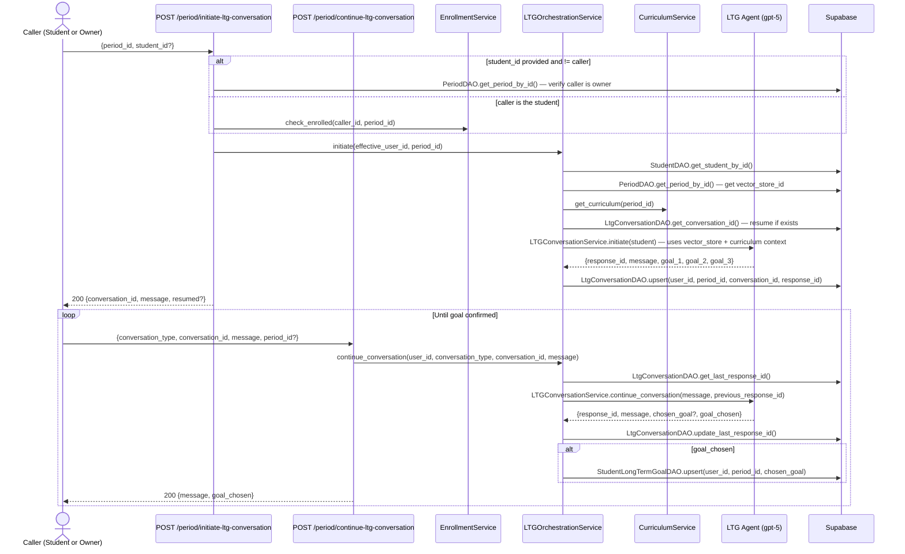

### Homework Agent

Requires an approved curriculum and a completed LTG conversation. Owner can run on behalf of an enrolled student.

```mermaid
sequenceDiagram
    actor T as Caller (Owner or Student)
    participant R as POST /period/initiate-homework-agent
    participant ES as EnrollmentService
    participant S as PeriodQuestService
    participant AI1 as LTG Schedule Agent (gpt-5)
    participant AI2 as HW Agent (gpt-5)
    participant DB as Supabase

    T->>R: {period_id, user_id?}
    alt user_id provided and != caller
        R->>DB: PeriodDAO.get_period_by_id() — verify caller is owner
    else caller is the student
        R->>ES: check_enrolled(caller_id, period_id)
    end
    R->>S: start_homework_agent(effective_user_id, period_id)
    S->>DB: StudentDAO.get_student_by_id()
    S->>DB: PeriodDAO.get_period_by_id()
    S->>DB: CurriculumService.get_curriculum(period_id) — must be status "approved"
    S->>S: build schedule [{Name, Skills, Week, DueDate}] from curriculum weeks
    S->>DB: LtgConversationDAO.get_conversation_id() — must exist
    S->>DB: StudentLongTermGoalDAO.get_by_student_and_period()
    opt long-term goal exists
        S->>AI1: LtgScheduleAgent.run(schedule, goal_text)
        Note over AI1: Renames per-week quest titles to align with student's goal
        AI1-->>S: enriched schedule (fallback to original names on agent failure)
    end
    S->>AI2: HWAgent.generate() — title then instructions then rubric per week
    AI2-->>S: [{title, instructions, rubric}]
    S->>DB: QuestService.update_quests_preserving_completed_data()
    Note over DB: Preserves already-graded/completed quests; updates unlocked ones; creates new ones
    R-->>T: 200 {quests_created: N}
```

---

## 7. Curriculum

### Generate Curriculum

Returns 202 immediately; generation runs as a background task. Poll `GET /curriculum/{period_id}/status` for `period_status` updates (`pending` → `generating` → `draft` or `failed`).

```mermaid
sequenceDiagram
    actor T as Client (Teacher / Parent)
    participant R as POST /curriculum/{period_id}/generate
    participant S as CurriculumService
    participant CE as Coverage Evaluator
    participant Perp as Perplexity API
    participant AI as Curriculum Agent (gpt-5)
    participant DB as Supabase

    T->>R: {}
    R->>R: _membership_or_summer() + _assert_period_owner(period, user_id)
    R->>S: trigger_generation(period_id, background_tasks)
    S->>DB: PeriodDAO.update_status("generating")
    Note over R,S: Returns immediately; rest runs in background

    S->>DB: PeriodDAO.get_period_by_id()
    alt has vector_store_id
        Note over S: Files mode — agent searches uploaded course documents
    else no files
        S->>CE: coverage_evaluator.evaluate(course_description)
        CE-->>S: {sufficient, research_queries[]}
        opt not sufficient and research_queries present
            S->>Perp: PerplexityService.research(queries, max_steps=5)
            Perp-->>S: research_context
        end
    end
    S->>AI: curriculum_agent.run(context)
    AI-->>S: CurriculumResult {weeks, lessons, concepts, skills}
    S->>DB: _bulk_replace(period_id, payload) — delete then reinsert all rows
    S->>DB: PeriodDAO.update_status("draft")
    Note over S,DB: On exception → update_status("failed") then re-raise
```

### Get and Edit Curriculum

- `GET /curriculum/{period_id}` — fetches full Week/Lesson/Concept/Skill/ConceptSkill tree in parallel (5 workers). Enrolled students or owner.
- `GET /curriculum/{period_id}/status` — returns `period_status` string. Enrolled students or owner.
- `PATCH /curriculum/{period_id}` — bulk-saves entire curriculum (delete-then-reinsert all rows). Owner only.
- `PATCH /curriculum/{period_id}/concepts/{concept_name}` — field-level concept update. Owner only.
- `PATCH /curriculum/{period_id}/skills/{skill_name}` — field-level skill update. Owner only.

### Approve Curriculum

Flips `period.status` to `"approved"` and triggers downstream generation. Summer and standard periods follow different paths after approval.

```mermaid
sequenceDiagram
    actor T as Client (Teacher / Parent)
    participant R as POST /curriculum/{period_id}/approve
    participant CS as CurriculumService
    participant SS as PptxGenerationService
    participant SQ as PeriodSummerQuestService
    participant BG as BackgroundTask

    T->>R: {}
    R->>R: _membership_or_summer() + _assert_period_owner(period, user_id)
    R->>CS: approve_period(period_id) — status must be "draft"; raises 400 if not
    CS->>CS: update period status to "approved"
    CS-->>R: lessons[]
    alt is_summer_quest
        R->>SS: prepare_batch(period_id, lessons) — insert LessonPptx rows (status=pending)
        R->>BG: spawn _run_slides_and_quests_parallel()
        Note over BG: ThreadPoolExecutor(max_workers=2) — runs both in parallel
        BG->>SS: run_batch(period_id) — async PPTX generation per lesson
        BG->>SQ: run_as_background_task(owner_id, period_id) — quest generation
    else standard period
        R->>SS: start_batch(period_id, background_tasks, lessons)
        Note over SS,BG: prepare_batch() inserts rows; run_batch queued as BackgroundTask
    end
    R-->>T: 202 {total_lessons: N}
```

---

## 8. PPTX / Slides

### PPTX Batch Pipeline

> Runs as a BackgroundTask. An `asyncio.Semaphore(8)` limits concurrent lesson generation.

```mermaid
sequenceDiagram
    participant BG as run_batch (background)
    participant Orch as Orchestrator Agent (gpt-5)
    participant CW as Content Writer Agent (gpt-5)
    participant NB as NanoBananaClient (Gemini)
    participant VR as Visual Review Agent (gpt-5)
    participant Rend as pptx_renderer + html_renderer
    participant S3 as AWS S3
    participant DB as Supabase

    BG->>DB: fetch all pending LessonPptx rows for period
    BG->>DB: fetch curriculum (lessons, concepts, skills, concept_skills)
    loop For each lesson (max 8 concurrent via semaphore)
        BG->>DB: LessonPptxDAO.update_status("generating")
        BG->>Orch: OrchestratorAgent.run(lesson_with_context, period_context)
        Note over Orch: Designs slide deck structure; invokes SLIDE_TOOLS per slide
        Orch->>CW: ContentWriterAgent — title, bullets, speaker notes per slide
        Orch->>NB: generate image per slide (where image requested)
        Orch->>VR: VisualReviewAgent — approved / regenerate / flag
        Note over VR: run_review_loop() retries on regenerate verdict
        Orch-->>BG: {pptx_bytes, html_str}
        BG->>Rend: pptx_renderer.render(slides) → .pptx bytes
        BG->>Rend: html_renderer.render(slides) → .html string
        BG->>S3: s3_service.upload_pptx() → pptx_key
        BG->>S3: s3_service.upload_html() → html_key
        BG->>DB: LessonPptxDAO.update_status("done", s3_key, html_key)
        Note over BG,DB: On exception → update_status("failed")
    end
```

### Slides Status Check

Access control varies by caller role.

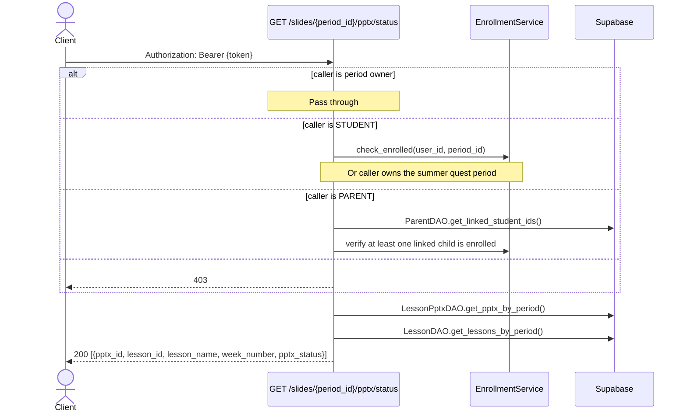

`POST /slides/{period_id}/pptx/restart` (teacher + owner only) — resets all `failed`/`generating` rows to `pending` and re-queues `run_batch`. Returns `{queued: N}`.

---

## 9. Lessons

Both endpoints use `_assert_lesson_access`: enrolled students pass; period owner passes; others 403.

```mermaid
sequenceDiagram
    actor C as Client
    participant R1 as GET /lessons/{lesson_id}/pptx
    participant R2 as GET /lessons/{lesson_id}/html
    participant S as lessons_service
    participant S3 as AWS S3
    participant DB as Supabase

    C->>R1: Authorization: Bearer {token}
    R1->>DB: LessonPptxDAO.get_latest_done_pptx(lesson_id) — 404 if none
    R1->>R1: _assert_lesson_access(period_id, auth)
    R1->>DB: LessonDAO.get_lesson_by_id(lesson_id)
    R1->>S3: s3_service.generate_presigned_url(pptx_s3_key, expiry=900)
    R1-->>C: 200 {url, expires_in: 900, version, lesson_name}

    C->>R2: Authorization: Bearer {token}
    R2->>DB: LessonPptxDAO.get_latest_done_pptx(lesson_id) — 404 if none; 404 if no html_key
    R2->>R2: _assert_lesson_access(period_id, auth)
    R2->>S3: s3_service.generate_presigned_url(html_key, expiry=3600)
    R2-->>C: 200 {url, expires_in: 3600}
```

---

## 10. Enrollment

### Verify and Enroll

The primary student enrollment path. Enforces the class *owner's* plan limits (not the student's), and requires `period.status == "approved"`.

```mermaid
sequenceDiagram
    actor C as Client (Student)
    participant R as POST /enrollment/verify-period
    participant MS as MembershipService
    participant ES as EnrollmentService
    participant DB as Supabase

    C->>R: {period_id, allow_parent_period?}
    R->>DB: PeriodDAO.get_period_by_id() — get owner_id
    R->>DB: UserDAO.get_by_id(owner_id) — get owner role
    R->>MS: check_can_add_student_to_period(owner_id, owner_role, period_id)
    Note over R,MS: 403 if owner's membership inactive or student-per-class limit reached
    R->>ES: verify_period_id(user_id, period_id, allow_parent_period)
    ES->>DB: verify period.status == "approved"
    ES->>DB: EnrollmentDAO.check_not_enrolled()
    ES->>DB: EnrollmentDAO.add_enrollment()
    opt first real-class enrollment
        ES->>DB: EnrollmentDAO.delete_tutorial_period_enrollment()
    end
    R-->>C: 200 {message, period}
```

### Unenroll Cascade

`POST /enrollment/unenroll` deletes all student data scoped to that period.

```mermaid
sequenceDiagram
    actor C as Client (Student)
    participant R as POST /enrollment/unenroll
    participant S as EnrollmentService
    participant DB as Supabase

    C->>R: {period_id}
    R->>S: unenroll_from_period(user_id, period_id)
    S->>DB: StudentDAO.get_student_by_id()
    S->>DB: EnrollmentDAO.get_enrollments_by_student() — verify enrolled
    S->>DB: EnrollmentDAO.delete_enrollment()
    S->>DB: LtgConversationDAO.delete_conversation(user_id, period_id)
    S->>DB: ConversationDAO.delete_conversation(user_id, period_id)
    S->>DB: StudentLongTermGoalDAO.delete(user_id, period_id)
    S->>DB: QuestDAO.get_quests_by_student_and_period()
    loop For each quest
        S->>DB: QuestDAO.delete_quest(quest_id)
    end
    R-->>C: 200
```

Other enrollment endpoints (no diagrams):

- `GET /enrollment/my-periods` — student's enrolled periods with LTG goals and metadata
- `GET /enrollment/enrollments/{period_id}` — teacher-only; list enrolled students (ownership required)
- `GET /enrollment/student-profile/{period_id}/{user_id}` — teacher-only; student profile fields
- `GET /enrollment/student/parent-periods` — student-only; parent-owned periods not yet enrolled in
- `POST /enrollment/accept-parent-invite` — student accepts invite code post-signup; same `parent_service.accept_invite()` as the inline signup path

---

## 11. Quest

### Retrieve Quests

Three route variants; all attach `grade_info` via `QuestRetrievalService.attach_grade_display()`.

```mermaid
sequenceDiagram
    actor C as Client
    participant R as Quest retrieval routes
    participant QS as QuestService
    participant DB as Supabase

    C->>R: Authorization: Bearer {token}
    alt GET /quest/quests  (?period_id optional)
        R->>QS: get_quests_for_student(user_id) or get_quests_for_student_and_period(user_id, period_id)
    else GET /quest/quests/{quest_id}
        R->>QS: get_quest_by_id(quest_id)
    else GET /quest/quests/student/{user_id}
        alt caller is PARENT
            R->>DB: ParentDAO.get_linked_student_ids() — verify child link
        else caller is TEACHER
            R->>DB: EnrollmentDAO + PeriodDAO — verify student enrolled in caller's period
        end
        R->>QS: get_quests_for_student(user_id) or get_quests_for_student_and_period()
    end
    QS->>DB: QuestDAO queries
    DB-->>QS: quest rows
    QS->>QS: attach_grade_display(quest) for each — adds grade_info, display_grade
    R-->>C: 200 [{quest_id, title, instructions, rubric, status, grade_info, ...}]
```

Other quest endpoints (no diagrams):

- `PUT /quest/quests/{id}/steps` — update `completed_steps[]`; pass-through to `QuestDAO`
- `PUT /quest/quests/{id}/status` — update status (`not_started | in_progress | completed`)
- `GET /quest/verify-quest-structure/{period_id}` — returns quest counts/week summary for debugging

### Teacher Grade Override

```mermaid
sequenceDiagram
    actor T as Client (Teacher)
    participant R as PUT /quest/quests/{quest_id}/grade
    participant S as QuestService
    participant DB as Supabase

    T->>R: {grade, feedback}
    R->>S: update_quest_grade_and_feedback(quest_id, grade, feedback)
    S->>DB: QuestDAO.get_quest_by_id() — verify period ownership
    S->>DB: QuestDAO.update_quest_grade_and_feedback()
    R-->>T: 200 {message, quest_id}
```

---

## 12. Billing

### Checkout Session

```mermaid
sequenceDiagram
    actor T as Client (Teacher / Parent)
    participant R as POST /billing/checkout-session
    participant MS as MembershipService
    participant SS as stripe_service
    participant DB as Supabase

    T->>R: {plan: "starter" | "growth" | "pro"}
    R->>R: map plan → STRIPE_PRICE_* env var
    R->>DB: UserDAO.get_by_id(user_id)
    R->>MS: get_membership(user_id)
    MS->>DB: MembershipDAO.get()
    R->>SS: get_or_create_customer(user_id, email, name, existing_customer_id)
    SS-->>R: stripe_customer_id
    opt new customer
        R->>MS: attach_stripe_customer(user_id, customer_id)
        MS->>DB: MembershipDAO.update(stripe_customer_id)
    end
    R->>SS: create_subscription_checkout_session(customer_id, price_id, success_url, cancel_url)
    SS-->>R: checkout_url
    R-->>T: 200 {url: checkout_url}
```

Other billing endpoints (no diagrams):

- `GET /billing/membership` — teacher/parent only; returns `membership_view()` with status, plan, limits, trial dates, available plans list
- `POST /billing/portal-session` — requires `stripe_customer_id` on membership row; calls `stripe_service.create_billing_portal_session()` → returns `{url}`

### Stripe Webhook

```mermaid
sequenceDiagram
    participant Stripe as Stripe
    participant R as POST /billing/webhook
    participant MS as MembershipService
    participant SS as stripe_service
    participant DB as Supabase

    Stripe->>R: POST {payload, Stripe-Signature header}
    R->>SS: construct_webhook_event(payload, signature, secret)
    Note over R,SS: Bad signature → 400 (Stripe will retry)
    alt customer.subscription.created / updated / trial_will_end
        R->>MS: apply_stripe_subscription(subscription)
        MS->>DB: find membership by stripe_customer_id
        MS->>DB: MembershipDAO.update() — plan, limits, status, current_period_end
    else customer.subscription.deleted
        R->>MS: mark_subscription_canceled(subscription_id)
        MS->>DB: MembershipDAO.update() — status=CANCELED
    else checkout.session.completed
        R->>SS: stripe.Subscription.retrieve(subscription_id)
        R->>MS: apply_stripe_subscription(subscription)
    else invoice.payment_failed
        R->>SS: stripe.Subscription.retrieve(subscription_id)
        R->>MS: apply_stripe_subscription(subscription)
    end
    R-->>Stripe: 200 {received: true}
    Note over R,Stripe: Always 200 — application errors are logged, not re-raised
```

---

## 13. Marketplace

Browse endpoints (`GET /marketplace`, `GET /marketplace/{listing_id}`) are open to any authenticated user.

```mermaid
sequenceDiagram
    actor T as Client (Teacher / Parent)
    participant R as /marketplace routes
    participant MS as MarketplaceService
    participant DB as Supabase

    Note over T,DB: Publish a class
    T->>R: POST / {period_id, tags[]}
    R->>MS: publish(period_id, user_id, tags)
    MS->>DB: MarketplaceListingDAO.insert()
    R-->>T: 200 {listing_id, ...}

    Note over T,DB: Unpublish
    T->>R: DELETE /{listing_id}
    R->>MS: unpublish(listing_id, user_id)
    MS->>DB: verify ownership + MarketplaceListingDAO.delete()
    R-->>T: 200 {message}

    Note over T,DB: Fork a class
    T->>R: POST /{listing_id}/fork
    R->>MS: fork(listing_id, user_id)
    MS->>DB: PeriodDAO.deep_copy() — new period with forked_from_period_id set
    Note over MS,DB: Curriculum and PPTX state copied; caller owns the fork
    MS-->>R: forked_period
    R-->>T: 200 {message, period}
```

---

## 14. Parent

### Generate Invite

```mermaid
sequenceDiagram
    actor P as Client (Parent)
    participant R as POST /parent/generate-invite
    participant S as ParentService
    participant DB as Supabase

    P->>R: {}
    R->>R: require_active_membership + assert role == PARENT
    R->>S: generate_invite(user_id)
    S->>S: generate 8-char random code (uppercase + digits)
    S->>S: expires_at = now + INVITE_EXPIRY_HOURS (24 h)
    S->>DB: ParentInviteDAO.insert()
    R-->>P: 201 {code, expires_at}
```

### Enroll Student (Parent-Initiated)

Three sequential guards before enrollment proceeds.

```mermaid
sequenceDiagram
    actor P as Client (Parent)
    participant R as POST /parent/enroll-student
    participant ES as EnrollmentService
    participant MS as MembershipService
    participant DB as Supabase

    P->>R: {student_id, period_id}
    R->>R: require_active_membership + assert role == PARENT
    R->>ES: validate_parent_enrollment_preconditions(parent_id, student_id, period_id)
    Note over R,ES: Verifies child is linked; not already enrolled
    R->>DB: PeriodDAO.get_period_by_id() — get owner_id, owner_role
    R->>MS: check_can_add_student_to_period(owner_id, owner_role, period_id)
    Note over R,MS: 403 if owner's membership inactive or student limit reached
    R->>ES: verify_period_id(student_id, period_id, allow_parent_period=True)
    ES->>DB: EnrollmentDAO.add_enrollment()
    R-->>P: 200 {message, period}
```

Other parent endpoints (no diagrams):

- `GET /parent/students` — returns linked children; sanitizes synthetic internal emails
- `GET /parent/my-periods` — periods the parent owns
- `POST /parent/create-student-profile` — creates a child account (`login_disabled=True`, `account_status="parent_managed"`, synthetic `child_*@internal.eduquestai.org` email)

---

## 15. Waitlist

```mermaid
sequenceDiagram
    actor T as Client (Teacher)
    participant R1 as POST /pilot-waitlist/join
    participant R2 as GET /pilot-waitlist/status
    participant R3 as POST /pilot-waitlist/approve/{user_id}
    participant S as WaitlistService
    participant DB as Supabase

    T->>R1: {referral_code?}
    R1->>S: join(user_id, referral_code)
    S->>DB: WaitlistDAO.insert()
    R1-->>T: 200 {position}

    T->>R2: {}
    R2->>S: get_status(user_id)
    S->>DB: WaitlistDAO.get_by_user_id()
    R2-->>T: 200 {position, approved}

    Note over R3: Requires TEACHER role AND caller in ADMIN_USER_IDS env var
    T->>R3: {}
    R3->>S: approve(user_id)
    S->>DB: TeacherDAO.update() — pilot_approved = true
    S->>DB: WaitlistDAO.update() — approved = true
    R3-->>T: 200
```

---

## 16. Feedback

`POST /feedback/submit` — any authenticated user. Body: `{message, page?}`. Message must be non-empty and ≤ 1,000 characters. Stored via `FeedbackService.submit(user_id, message, page)`.

---

## 17. Background Tasks Reference

| Pipeline | Trigger | Key agents / services | Status field |
|---|---|---|---|
| Period file ingestion | `POST /period/create-period` (standard) or finalize setup draft | CanvasService, openai_vector_store, S3, then auto-triggers curriculum | `period.processing_status` |
| Curriculum generation | `POST /curriculum/{id}/generate` or auto after file ingestion | CoverageEvaluator, PerplexityService (optional), CurriculumAgent | `period.status` |
| PPTX batch | `POST /curriculum/{id}/approve` | OrchestratorAgent, ContentWriterAgent, NanoBananaClient, VisualReviewAgent, S3 | `lesson_pptx.status` |

See [ARCH_DECISIONS.md](ARCH_DECISIONS.md) for the rationale behind each pipeline's design.

---

## 18. AI Agent Reference

All agents live in `bots/` and use the OpenAI Agents SDK (`from agents import Agent, Runner`). Structured outputs use Pydantic schemas in `bots/schemas/`.

| Agent | File | Model | Purpose |
|---|---|---|---|
| Profile Agent | `profile_agent.py` | gpt-4.1-mini | Gathers student strengths, weaknesses, interests, learning style via multi-turn chat |
| LTG Agent | `ltg_agent.py` | gpt-5 | Suggests 3 long-term goals aligned with course content (uses vector store file search) |
| LTG Schedule Agent | `quests/ltg_schedule_agent.py::LtgScheduleAgent` | gpt-5 | Renames per-week quest titles to align with the student's confirmed long-term goal |
| HW Agent | `quests/quest_agent.py::HWAgent` | gpt-5 | Generates personalised quest title, instructions, and rubric per student (async) |
| Curriculum Quest Agent | `quests/curriculum_only_quest_agent.py` | gpt-5 | Generates quests for summer side-quest periods without a student profile (curriculum-only input) |
| Grading Orchestrator | `grading_agent.py::GradingOrchestrator` | gpt-5 | 4 sequential sub-agents: numerical grade, written feedback, skill mastery scores, homework recommendations |
| Curriculum Agent | `curriculum/curriculum_agent.py::CurriculumAgent` | gpt-5 | Generates Week→Lesson→Concept→Skill hierarchy; accepts Perplexity research context for curriculum gaps |
| Pptx Orchestrator | `slideshow/orchestrator_agent.py::OrchestratorAgent` | gpt-5 | Designs slide deck structure; delegates content and image generation to specialist agents via SLIDE_TOOLS |
| Content Writer | `slideshow/content_writer_agent.py::ContentWriterAgent` | gpt-5 | Writes title, bullets, and speaker notes per slide |
| Visual Review | `slideshow/visual_review_agent.py::VisualReviewAgent` | gpt-5 | Reviews generated images and returns approved / regenerate / flag verdict |
| Teacher Feedback Agent | `teacher_feedback_agent.py` | gpt-5 | Turns teacher notes into structured feedback and quest change recommendations for students |

Content safety is applied via `bots/guardrails.py::check_student_output_safety()` before returning agent responses to the client.

---

## Data Tables Reference

See [data_access/DATA_TABLES.md](data_access/DATA_TABLES.md).
